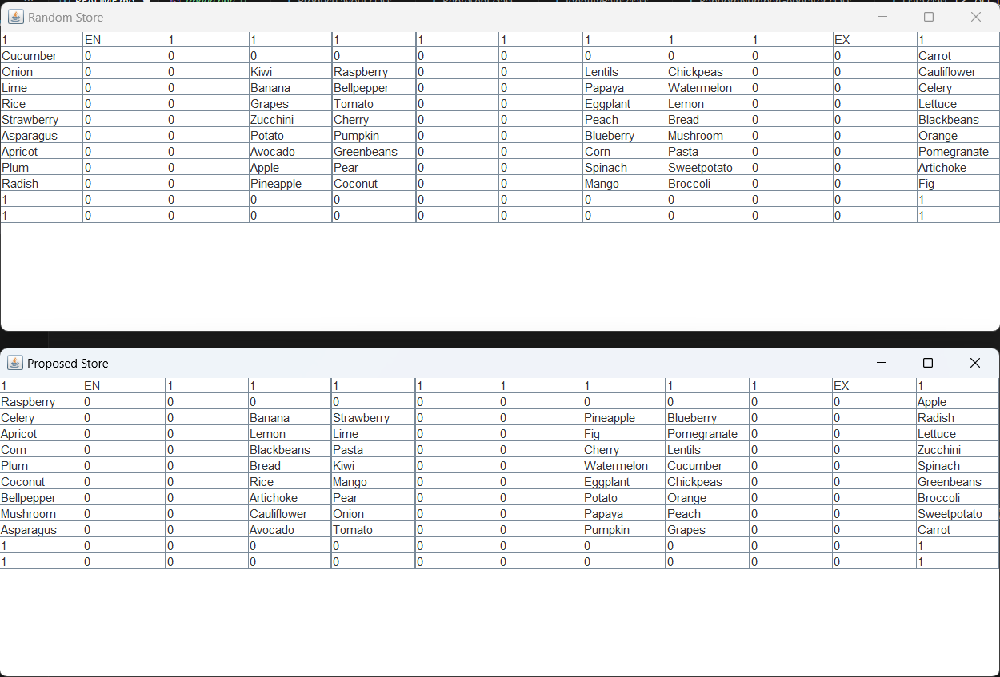
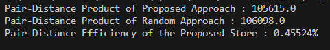

<<<<<<< HEAD


=======
# Retail Store Layout Optimization and Route Simulation System

## Overview

This project presents a Java-based system for analyzing customer purchase behavior and improving retail store efficiency through optimized product placement and route simulation.

The system models a retail store layout as a grid-based environment implemented through a Java interface and applies graph algorithms to analyze navigation efficiency and product placement.

By analyzing frequently purchased product combinations and evaluating distances between product locations, the system can simulate customer routes and assess store layout efficiency.

This project was developed as part of an undergraduate course project under the guidance of the course instructor.

---

## Objectives

The project aims to:

- Analyze customer purchasing patterns

- Optimize product placement within a retail store

- Simulate customer navigation routes inside the store

- Evaluate store layout efficiency

- Apply classical graph algorithms and optimization techniques to retail problems

---

## System Design
### Store Layout Representation

The store environment is represented as a grid-based layout using a Java interface.

- Each grid position represents a product location or navigation space

- The store structure is internally modeled as a graph

- Nodes represent locations

- Edges represent paths between locations
  
---

## Algorithms Used
### Shortest Path Computation

The system uses Dijkstra’s Algorithm to calculate the shortest path between locations in the store.

### Route Optimization

A modified Held–Karp algorithm is used to determine an optimal route when a customer needs to visit multiple product locations.

### Purchase Pattern Analysis

Customer purchase data is analyzed to detect frequently bought product pairs, which are then used to evaluate and improve product placement.

## Key Features

- Grid-based store layout modeling

- Customer route simulation within a retail environment

- Shortest path computation using Dijkstra's Algorithm

- Multi-location route optimization using Held–Karp Algorithm

- Store layout evaluation based on purchase behavior

- Purchase data analysis using generated transaction datasets

## Data Handling
### Purchase Data

- Purchase data is stored in TXT files generated through a test data generation program.

- The generated datasets simulate customer transaction histories, which are used to identify frequently purchased product combinations.

### Data Processing

Data analysis is performed using:

- HashMaps

- LinkedHashMaps

- Java Streams

## Route Simulation

The system simulates customer navigation through the store by:

1. Identifying product locations

2. Computing optimal routes between them

3. Storing the resulting path in a list structure

4. Displaying the computed path through console output

## My Contributions

Although this project was originally assigned as a team project, it was completed individually after the team member stopped participating early in the course.

My contributions include:

- Designing the system structure and implementation approach

- Implementing Dijkstra’s algorithm for shortest path computation

- Applying a modified Held–Karp algorithm for route optimization

- Developing a route simulation system

- Designing and implementing an original algorithm to evaluate store layout efficiency

- Implementing purchase data analysis using Java data structures

- Generating synthetic datasets for testing

- Conducting experiments and testing to evaluate system performance

## Technologies Used

### Programming Language

Java

### Algorithms

- Dijkstra's Algorithm

- Held–Karp Algorithm

### Concepts

- Graph Algorithms

- Combinatorial Optimization

- Data Structures

- Algorithm Analysis

### Tools

- Git

- GitHub

- Visual Studio Code

## How to Run the Project
### Clone the repository
```
git clone https://github.com/Tithira99/Retail_Store_Layout_Optimization_and_Route-Simulation-Systems.git
```
### Navigate to the project folder
cd Retail_Store_Layout_Optimization_and_Route-Simulation-Systems/TaskXX
### Compile the project
javac example.java
### Run the program(class file)
java example <input filename>  

(Command may vary depending on each task's folder structure.)

---
## Screenshots

Below are some screenshots of the results by the Task 7. 

Below image shows a randomly created arrangement of stocks in a store(grid structure) and an arrangement of the store created by analyzing the purchase history(proposed store)


Below image shows an output of the Task 7 in the console which displays values related to the efficiency calculation of the proposed store with respect to the related pairs of products.


## Potential Applications

The concepts implemented in this project can be applied in:

- Retail store layout optimization

- Warehouse product placement

- Supermarket navigation systems

- Customer behavior analysis

- Logistics and path optimization systems

## Future Improvements

Possible improvements include:

- Adding graphical visualization for routes

- Integrating real-world retail datasets

- Applying machine learning for purchase prediction

- Developing a graphical UI for store layout editing

- Extending the system for large-scale retail environments
>>>>>>> 9f3c4ddcb639f58e8105b0a090f6436e6a3926a8
